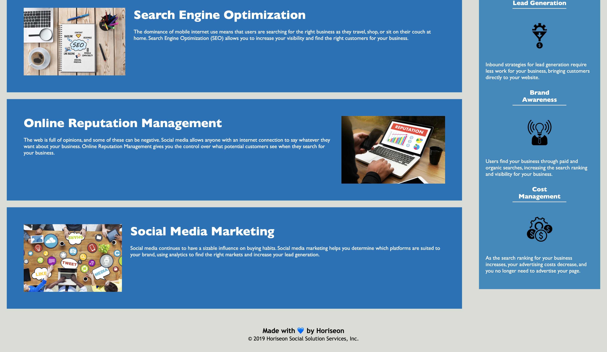

# Code Refactor For Horiseon
## Pupose
A website that offers Search Engine Optimization, Online Reputation Management and Social Media Marketing. 
## Built With
- HTML
- CSS
## Website
[Horiseon URL](https://mr2447.github.io/horiseon-refactor/)
[GitHub repo](https://github.com/mr2447/horiseon-refactor)
## Contribution
Made with ❤ by Marvin Ren
© 2019 Horiseon Social Solution Services, Inc.
## Changes made in index.html
    1. line 2, <html lang="en-us"> change to "en". us is not necessary.
    2. line 6, title should be Horiseon and not website.
    3. line 11, a class of header is not necessary its style is unique to this website. 
    4. line 12, make header, h1 an anchor element with href attribute and value of /.
    5. line 13, note that span was used to change its color within the word.
    6. line 27, class of hero is contatined in a section, not a div.
    7. line 34. comments changed to article as it is mainly text.
    8. line 35, renamed class=contents for DRY css codes. 
    9. line 36, added class-content for DRY css codes and changed div to article. 
    10. line 37, added alt attribute to each img in content for better accessibility.
    11. line 70, changed div to section. 
    12. line 71, changed div to article.
    13. line 71, renmaned class benefit for DRY css codes. 
    14. line 73, added alt attribute of value "" to each icons in benefit for better accessibility.
    15. line 87, img element is self-enclosed.
    16. line 93, footer comment added.
    17. in general, small semantic elements were added or chnaged and spacing were changed to make the code more readable. 
## Changes made in style.css 
    1. body {} added font family to apply to, in this case, the header and the footer. 
    2. body {} maybe too many backup font-families incase if the previous one is not supported.
    3. added comments to each section (ex. /*Header Starts*/)
    4. header class is deleted as its style is unique to this website. 
    5. grouped all relevent css declarations together in the order of apareance in the html.
    6. class h1 .seo is unecessary element ID, class followed by . is enough. And renamed to title-text-seo.
    7. added pusedo elements to the anchor elements in nav.
    8. .content is created for DRY css codes.
    9. .content h2 is created for DRY css codes.
    10. .content img is created for Dry css codes.
    11. .benefit is created for Dry css codes.
    12. .benefit h3 is created for Dry css codes.
    13 .benefit img is created for Dry css codes. 
    14. deleted font family in .footer as it is already in body. 
    15. deleted font size for all 
 as the default 16px is the desired size.
## Enhancements
    1. anchor in nav was given text-shadow, border color pusedo elements.
    2. cursor changes to pointer when hovering over anchor elemtns.
    3. bottom border solid lines added to benefit h3. width adujsted to look better.
    4. heart symbol in footer changed to blue to look better. 
 
## Screen shot

